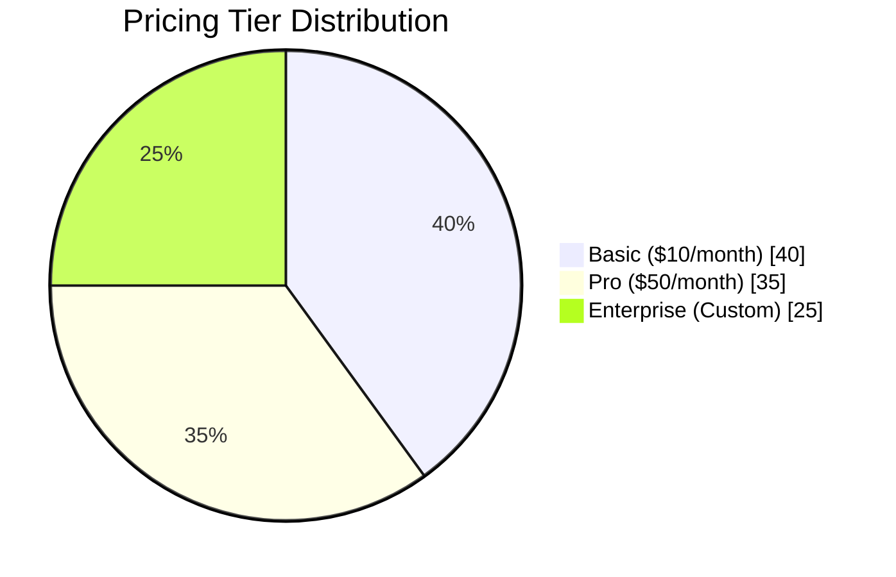

# Our Mission

Our mission is to provide reliable cloud solutions that help organizations manage data, collaborate efficiently, and scale their systems with confidence.

# Company Overview

Acme Cloud provides cloud infrastructure designed to support modern applications and teams. The platform replaces older legacy server systems with a more flexible cloud-based environment.

The goal of Acme Cloud is to simplify system management while improving performance and accessibility for users.

## Key Features

Acme Cloud includes several tools designed to support teams and developers:

- Web-based dashboard for managing services
- Scalable storage options
- Cloud infrastructure designed for reliability and performance

## Pricing Tiers

Acme Cloud offers several pricing plans based on storage and usage needs.

The chart below provides a quick visual breakdown of our pricing tiers.

- **Basic** – $10/month with 5 GB of storage  
- **Pro** – $50/month with 100 GB of storage  
- **Enterprise** – Custom pricing available through the sales team  

## Support

If you experience issues with the platform, contact the support team for assistance.

Email: support@acme-cloud-2020.com

