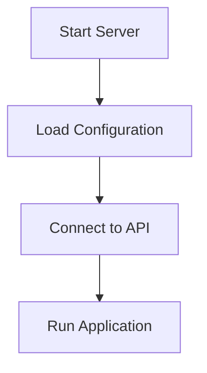

# Server Configuration

This document explains the configuration settings used in the development server environment.

## Server Settings

The development server uses the following configuration:

- **Host:** api.acme-internal.com
- **Port:** 8080
- **Timeout:** 60 seconds

## System Configuration

The server configuration includes the following settings:

- API version: v4.2.1
- Caching enabled
- Maximum users: 500

### Feature Flags

The system currently supports the following experimental features:

- beta_dashboard
- dark_mode

## Known Issues

The **Dark Mode** feature may crash if it is clicked twice.  
If this occurs, refresh the page to resolve the issue.

## Running the Server

To start the production server, run the following command:
npm run start:prod
**Requirements:** Node.js version 14 or higher.

## Server Process Overview

